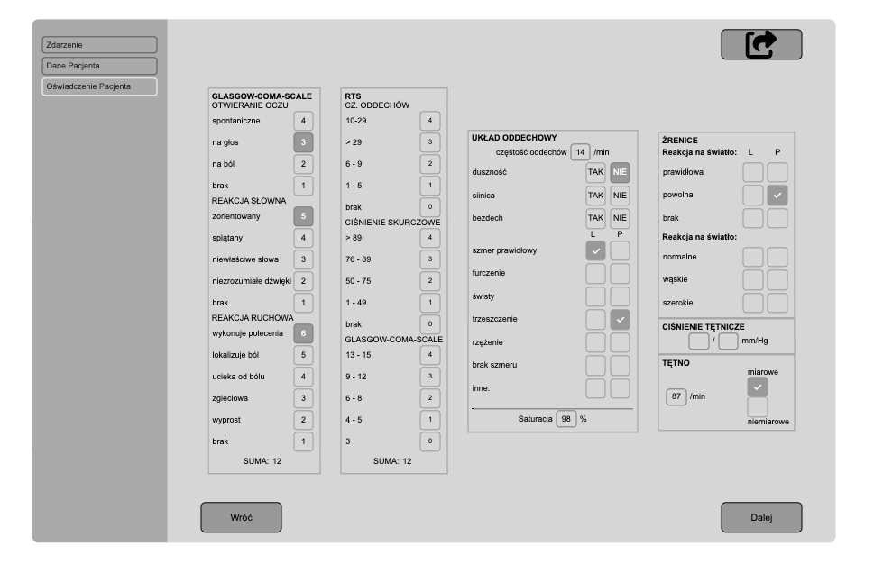

# Individual Paramedic Card

## English Description 🇬🇧

The application allows the user to fill out an individual paramedic card and save it as a PDF or print it. The application works offline, ensuring accessibility even without an internet connection.

## Features

- Entering and validating incident data.
- Entering paramedic information.
- Entering and validating patient data.
- Marking the patient's refusal statement.
- Entering and verifying the patient interview.
- Entering and marking the patient's health parameters.

## Project Structure

- `AppContext`: Contains an array with all necessary data.
- `App`: The main component that calls subsequent components of the application.
- `IncidentData`: Handles incident data.
- `PatientData`: Stores information about the injured person.
- `Statement`: Manages the patient's refusal statement.
- `Interview`: Stores and handles the patient interview.
- `AssessHealthCondition`: Collects and manages the patient's health parameters.

## Technologies Used

- TypeScript
- React
- Vite
- Formik
- Context API
- SASS (using modules)
- Responsive design techniques (media queries, flexbox, CSS Grid)

## Polski Opis 🇵🇱

Aplikacja umożliwia użytkownikowi wypełnienie indywidualnej karty ratownika medycznego oraz zapisanie jej w PDF lub wydruk. Aplikacja działająca offline.

## Funkcjonalności

- wpisanie i sprawdzenie poprawności danych zdarzenia.
- wprowadzenie danych ratownika
- wpisanie i sprawdzenie poprawności danych pacjenta
- zaznaczenie wyboru oświadczenia pacjenta
- wprowadzenie i sprawdzenie wywiadu z pacjentem
- wprowadzenie i oznaczenie parametrów pacjenta

## Struktura projektu

- `AppContext`: Zawiera tablicę z wszystkimi potrzebnymi danymi.
- `App`: Główny komponent wywołujący kolejne.
- `IncidentData`: Dane zdarzenia.
- `PatientData`: Dane osoby poszkodowane.
- `Statement`: Oświadczenie pacjenta o odmowie.
- `Interview` : Wywiad z pacjentem.
- `AssessHealthCondition`: Zbiera zbadane parametry pacjenta

## Zastosowane technologie

- Typescript
- React
- Vite
- Formik
- Context
- SASS (z wykorzystaniem modułów)
- Techniki responsywnego projektowania (media queries, flexbox, CSS Grid)
